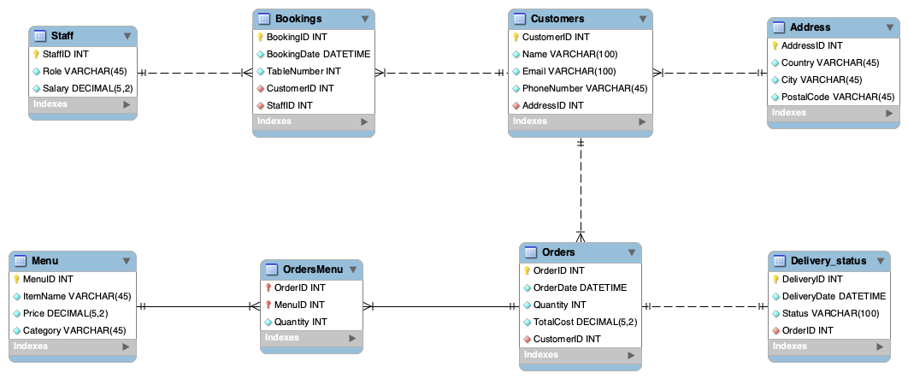
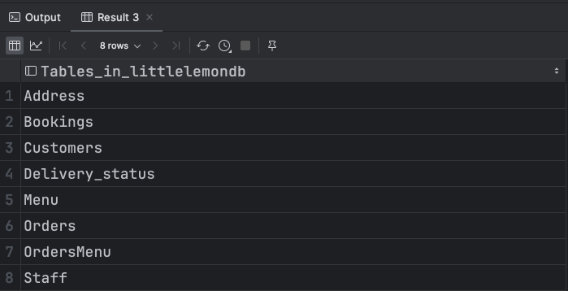

# Coursera Meta Database Engineering Capstone Project

## Overview

This project revolves around creating a comprehensive booking system
for the Little Lemon Company, a renowned restaurant chain. The primary
objective is to develop a robust relational database in MySQL capable
of storing and managing large amounts of data efficiently. The system
will maintain information pertaining to various aspects of the
business, including bookings, orders, delivery statuses, menus,
customer details, and staff information.

## Project Structure

The project is divided into several distinct tasks, each focusing on a
specific aspect of the database development process:

1. **Data Modeling**
   - Creating an Entity-Relationship (ER) Diagram
   - Generating the Database Schema
   - Populating the Relations with Data

2. **Adding Sales Report**
   - Implementing Joins
   - Creating Views
   - Utilizing Special Operators (e.g., ANY)

3. **Creating Optimized Queries**
   - Developing Stored Procedures
   - Utilizing Prepared Statements

4. **Setting up Tableau Workspace for Data Analysis**

5. **Python Client**


## Data Modeling

### Task 1: Creating an ER Diagram

In this task, a normalized ER diagram adhering to the 1st, 2nd, and
3rd Normal Forms (1NF, 2NF, and 3NF) was created using MySQL Workbench
Model Editor. The diagram accurately represents the data requirements
of Little Lemon, including entities, attributes, primary keys, foreign
keys, data types, and constraints. The ER diagram was exported as a
PNG file for documentation purposes.



### Task 2: Creating Database Schema

The forward engineering feature in MySQL Workbench was utilized to
generate the SQL schema for the Little Lemon Database. The SQL code
for creating the database schema is provided in the project
documentation.



### Task 3: Populating with Data

SQL queries were executed to insert data into the newly created
tables, ensuring the database is populated with relevant information
for testing and analysis purposes [populating database with data](populating_with_data.sql).

## Adding Sales Report

### Task 1: Views

In this task, a virtual table named `OrdersView` was created, focusing
on the `OrderID`, `Quantity`, and `TotalCost` columns from the
`Orders` table for all orders with a quantity greater than 2.

```MySQL
CREATE VIEW OrdersView AS
    SELECT O.OrderID, O.Quantity, O.TotalCost
    FROM LittleLemonDB.Orders AS O
    WHERE O.Quantity > 2;

SELECT * FROM OrdersView;
```

### Task 2: Joins

This task involved extracting information from multiple tables using
the appropriate JOIN clauses. Specifically, it retrieved customer
details and order information for all customers with orders costing
more than $50.

``` MYSQL
SELECT C.CustomerID, C.Name, O.OrderID, O.TotalCost
	FROM Orders AS O
	INNER JOIN Customers AS C ON O.CustomerID = C.CustomerID
	WHERE O.TotalCost > 50;
```

### Task 3: Special Operator (ANY)

The final task in this section involved finding all menu items for
which more than two orders have been placed. This was achieved by
creating a subquery that listed the menu names from the `Menu` table
for any order quantity with a sum greater than 2.

``` MySQL
SELECT m.ItemName
	FROM Menu AS m
	WHERE m.MenuID = ANY (
		SELECT MenuID
		FROM OrdersMenu
		GROUP BY MenuID
		HAVING SUM(Quantity) > 2
);
```

## Creating Optimized Queries
Little Lemon need to query the data in their database. To do this,
they need your help with creating optimized queries using stored
procedures and prepared statements.

### Task 1: Stored Procedures

A stored procedure named `GetMaxQuantity()` was created to display the
maximum ordered quantity in the `Orders` table. This procedure allows
Little Lemon to reuse the logic without retyping the same code
repeatedly.

``` MySQL
CREATE PROCEDURE GetMaxQuantity()
BEGIN
    SELECT MAX(Quantity) AS 'Get Max Quantity'
        FROM Orders;
end;

CALL GetMaxQuantity();
```

### Task 2: Prepared Statements

A prepared statement called `GetOrderDetail` was implemented to reduce
query parsing time and enhance database security against SQL
injections.

``` MySQL
PREPARE GetOrderDetail FROM
    'SELECT OrderID, Quantity, TotalCost
        FROM Orders
        WHERE CustomerID = ?';

SET @id = 1;
EXECUTE GetOrderDetail USING @id;
```

### Task 3: Stored Procedure for Order Cancellation

A stored procedure named `CancelOrder` was developed to delete an
order record based on the provided order ID through user input.


``` MySQL
CREATE PROCEDURE CancelOrder(IN order_id INT)
BEGIN
    DELETE FROM Orders
           WHERE CancelOrder.order_id = Orders.OrderID;
end;

CALL CancelOrder(3);
```

## Setting up Tableau Workspace for Data Analysis

### Task 1: Data Preparation

- Connected to Little Lemon's data stored in an Excel sheet file.
- Filtered data in the data source page to select "United States" as the country.
- Created two new data fields, "First Name" and "Last Name," by extracting values from the "Full Name" field.
- Calculated a new data field to store the profits for each sale or order.
 

### Task 2: Data Visualization

- Created a bar chart titled "Customers Sales" to display customers' sales, filtered for sales with at least $70.
  
- Developed a line chart named "Profit Chart" to show the sales trend from 2019 to 2022.
  
- Generated a bubble chart titled "Sales Bubble Chart" to visualize sales for all customers.
  
- Compared the sales of three different cuisines (Turkish, Italian,
  and Greek) sold at Little Lemon using a bar chart for the years
  2020, 2021, and 2022.
    
- Created an interactive dashboard combining the "Customer Sales" bar
  chart and the "Sales Bubble Chart" for comprehensive data analysis.
    

## Python Client

### Task 1: Establishing a Connection

- Installed the necessary Python libraries, including `mysql-connector`.
- Established a connection between Python and the MySQL database using the `connector` API.
- Created a cursor object to communicate with the entire MySQL database.
- Set the `LittleLemonDB` database for use.

- Importing MySQL Connector/Python 

```Python
import mysql.connector as connector
from mysql.connector import Error
```

- Establishing connection between Python and MySQL database via connector API

``` Python
try:
    connection=connector.connect(user="root",password="")
except Error as er:
    print(er.msg)

print("Connection between MySQL and Python is established.\n")
```

- Creating a Cursor :

```
cursor = connection.cursor()
print("Cursor is created to communicate with the MySQL using Python.")
```

- Setting the Database for use :
```
cursor.execute("USE LittleLemonDB")
connection.database
print("The database LittleLemonDB is set for use.")
```

### Task 2: Querying the Database

A query was executed to display all tables within the `LittleLemonDB` database.
```
show_tables_query = "SHOW TABLES;" 

cursor.execute(show_tables_query)

results=cursor.fetchall()

columns=cursor.column_names

print(columns)
for result in results:
    print(result)
```

### Task 3: Query with Table JOIN

In this task, a specific query was implemented to retrieve the full
name, contact details, and order information for every customer who
placed an order greater than $60. This information will be used for a
promotional campaign by Little Lemon.

```
join_query = """ SELECT Customer.FullName,
Customer.ContactNumber,
Customer.Email,
Orders.TotalCost
FROM Customer
LEFT JOIN Orders
ON Customer.CustomerID = Orders.CustomerID
WHERE Orders.TotalCost > 60;
```

```
cursor.execute(join_query)
```

Fetching the results in a variable called "results".

```
results = cursor.fetchall()
```

Extracting the names of the columns.

```
columns=cursor.column_names
```
Printing the names of the columns and the stored data using the "for" loop.

```
print(columns)
for result in results:
    print(result)
```

Closing the Connection between Python and MySQL database.

```
if connection.is_connected():
    cursor.close()
    print("The cursor is closed.")
    connection.close()
    print("MySQL connection is closed.")
else:
    print("Connection is already closed")
```

## Conclusion

This capstone project successfully delivered a comprehensive booking
system for Little Lemon Company, complete with a robust relational
database, optimized queries, data analysis capabilities, and a Python
client for seamless data management. The system is designed to
streamline operations, enhance customer experience, and enable
data-driven decision-making for the restaurant chain.
